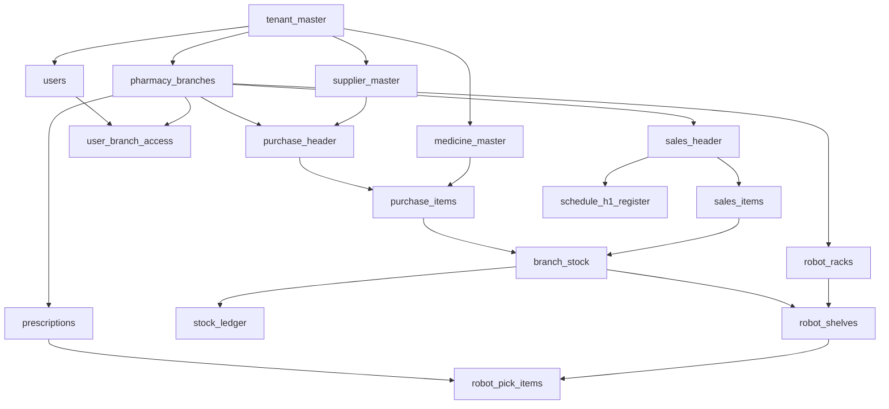
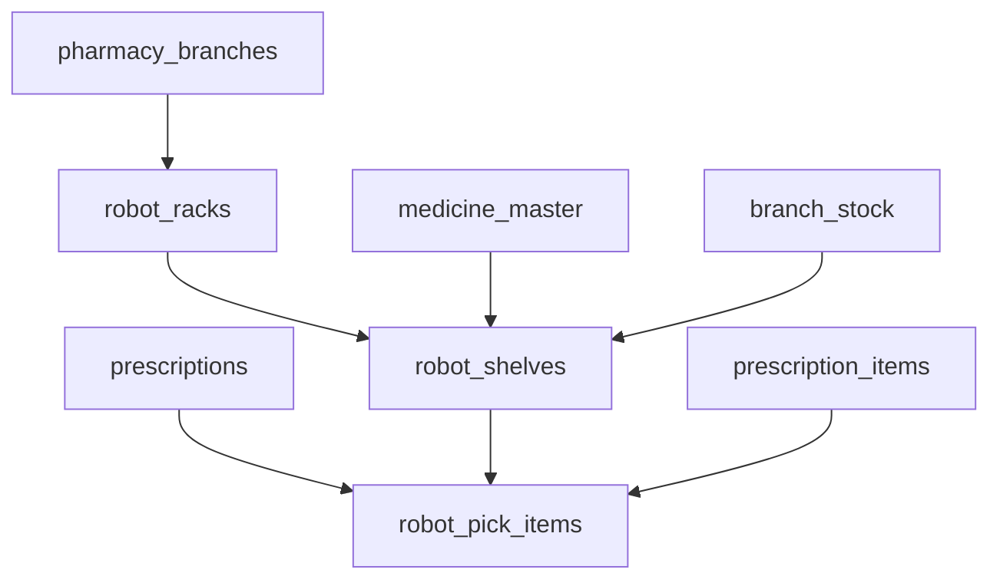

# Pharmacy Database Schema (India, Multi-Pharmacy)

PostgreSQL 14+ schema for Indian retail pharmacy software with multi-tenant accounts, multi-branch outlets, GST invoicing, batch stock, Schedule H/H1/X compliance, full POS workflows, and per-branch robot rack/shelf picking.

**Source files**

| File | Purpose |
|------|---------|
| [pharmacy.sql](pharmacy.sql) | Full DDL (tables, enums, indexes, triggers, view) |
| [seed_india.sql](seed_india.sql) | Reference data: GST states, tax slabs, HSN, payment modes, roles |
| [sample_data.sql](sample_data.sql) | Demo inserts: one shop, rack/shelves, Rx robot pick |

---

## Quick start

```bash
createdb pharmacy
psql -d pharmacy -f schema/pharmacy.sql
psql -d pharmacy -f schema/seed_india.sql
psql -d pharmacy -f schema/sample_data.sql   # optional demo tenant + robot pick
```

---

## Architecture overview

The schema uses a **multi-tenant, multi-branch** model:

- **Tenant** — the software customer (pharmacy owner / company). One account can own many shops.
- **Branch** — each physical pharmacy outlet with its own GSTIN, drug licences, and stock.
- **User** — staff login scoped to a tenant; branch access is controlled separately.



### Data ownership

| Data | Scope | Notes |
|------|-------|-------|
| Users, medicines, suppliers, doctors, customers | **Tenant** | Shared across all branches of one owner |
| Purchases, sales, stock, invoices, H1 register, robot racks/shelves | **Branch** | Each shop has its own transactions and robot grid |
| GSTIN, DL 20B/21B, FSSAI, pharmacist | **Branch** | Different states require different GSTINs |
| GST states, tax rates, HSN, roles | **Global** | Seeded reference data |

---

## Enums

| Enum | Values | Used for |
|------|--------|----------|
| `gst_registration_type` | REGULAR, COMPOSITION, UNREGISTERED | Tenant, supplier GST status |
| `user_status` | ACTIVE, INACTIVE, LOCKED | User account state |
| `medicine_category` | ALLOPATHIC, AYURVEDIC, HOMEOPATHIC, SURGICAL, FMCG, OTHER | Product classification |
| `medicine_form` | TABLET, CAPSULE, SYRUP, INJECTION, … | Dosage form |
| `drug_schedule` | NONE, OTC, H, H1, X | Drugs & Cosmetics Act scheduling |
| `payment_status` | PENDING, PARTIAL, PAID | Purchase and sales bills |
| `gst_invoice_type` | B2B, B2C | Sales invoice type |
| `stock_txn_type` | PURCHASE, SALE, PURCHASE_RETURN, SALE_RETURN, TRANSFER_OUT, TRANSFER_IN, ADJUSTMENT, EXPIRY_WRITEOFF, ROBOT_PICK | Stock ledger movement types |
| `transfer_status` | DRAFT, IN_TRANSIT, RECEIVED, CANCELLED | Inter-branch transfers |
| `adjustment_reason` | BREAKAGE, THEFT, RECOUNT, EXPIRED, OTHER | Stock adjustments |
| `document_type` | SALE_INVOICE, PURCHASE, SALE_RETURN, … | Invoice numbering sequences |
| `round_off_mode` | NEAREST, UP, DOWN, NONE | Tenant billing settings |
| `robot_status` | QUEUED, PICKING, COMPLETED, FAILED | Robot fulfilment of a prescription |

---

## Lookup and reference tables

### `gst_states`

Indian GST state/UT codes for place of supply.

| Column | Type | Description |
|--------|------|-------------|
| state_code | CHAR(2) PK | GST state code (e.g. `33` = Tamil Nadu) |
| state_name | VARCHAR(100) | State or UT name |
| is_union_territory | BOOLEAN | Whether the code is a UT |
| is_active | BOOLEAN | Soft enable flag |

### `tax_rates`

Standard GST slabs.

| Column | Type | Description |
|--------|------|-------------|
| tax_rate_id | BIGINT PK | Auto identity |
| gst_percent | NUMERIC(5,2) UNIQUE | GST rate (0, 5, 12, 18, 28) |
| description | VARCHAR(100) | Human-readable label |

### `hsn_master`

HSN codes with default GST rates for medicines and related goods.

| Column | Type | Description |
|--------|------|-------------|
| hsn_id | BIGINT PK | Auto identity |
| hsn_code | VARCHAR(8) UNIQUE | HSN code (e.g. `3004`) |
| default_gst_percent | NUMERIC(5,2) | Suggested GST rate |

### `payment_modes`

Counter and supplier payment methods (Cash, UPI, Card, NEFT, Cheque, Credit).

### `roles`

System roles: **OWNER**, **PHARMACIST**, **CASHIER**, **INVENTORY**.

---

## Tenancy and branches

### `tenant_master`

Software buyer / pharmacy company.

| Column | Type | Description |
|--------|------|-------------|
| tenant_id | BIGINT PK | Auto identity |
| owner_name | VARCHAR(150) | Primary account holder |
| company_name | VARCHAR(200) | Legal business name |
| pan_number | VARCHAR(10) | PAN (validated format) |
| email | CITEXT | Contact email (unique when set) |
| phone | VARCHAR(15) | Contact phone |
| gstin_number | VARCHAR(15) | Company-level GSTIN (optional) |
| gst_registration_type | ENUM | REGULAR / COMPOSITION / UNREGISTERED |
| is_active | BOOLEAN | Soft delete |
| created_at / updated_at | TIMESTAMPTZ | Audit timestamps |
| created_by | BIGINT FK → users | Who created the record |

### `pharmacy_branches`

Each retail outlet or warehouse under a tenant.

| Column | Type | Description |
|--------|------|-------------|
| branch_id | BIGINT PK | Auto identity |
| tenant_id | BIGINT FK | Owning tenant |
| branch_name | VARCHAR(200) | Shop name (unique per tenant) |
| gstin_number | VARCHAR(15) | Branch GSTIN (state-specific) |
| dl_number_20b | VARCHAR(50) | Drug licence 20B (retail) |
| dl_20b_expiry | DATE | 20B expiry |
| dl_number_21b | VARCHAR(50) | Drug licence 21B (Schedule C/C1) |
| dl_21b_expiry | DATE | 21B expiry |
| fssai_number | VARCHAR(20) | Food licence (supplements, baby food) |
| fssai_expiry | DATE | FSSAI expiry |
| address, city, pincode | TEXT/VARCHAR | Location |
| state_code | CHAR(2) FK → gst_states | GST state |
| phone, email | VARCHAR/CITEXT | Branch contact |
| pharmacist_name | VARCHAR(150) | Registered pharmacist on duty |
| pharmacist_reg_no | VARCHAR(50) | Pharmacist registration number |
| is_warehouse | BOOLEAN | True if this branch is a warehouse, not a counter |

**Unique:** `(tenant_id, branch_name)`

---

## Authentication and access

### `users`

Staff accounts. Each user belongs to exactly one tenant.

| Column | Type | Description |
|--------|------|-------------|
| user_id | BIGINT PK | Auto identity |
| tenant_id | BIGINT FK | Tenant scope |
| role_id | BIGINT FK → roles | OWNER / PHARMACIST / CASHIER / INVENTORY |
| full_name | VARCHAR(150) | Display name |
| email | CITEXT | Login email (unique per tenant) |
| phone | VARCHAR(15) | Optional phone |
| password | VARCHAR(255) | password |
| status | user_status | ACTIVE / INACTIVE / LOCKED |


### `user_branch_access`

Maps users to branches they can operate. Enables “switch pharmacy” for owners and branch-restricted access for staff.

| Column | Type | Description |
|--------|------|-------------|
| access_id | BIGINT PK | Auto identity |
| user_id | BIGINT FK | User |
| branch_id | BIGINT FK | Allowed branch |
| is_default | BOOLEAN | Default branch on login |

**Unique:** `(user_id, branch_id)`

### `sessions`

Refresh-token sessions for web/mobile login. Stores hashed token, user agent, IP, expiry, and revocation.

---

## Settings and document numbering

### `tenant_settings`

One row per tenant: financial year start month (default April = 4), allow-below-MRP flag, round-off mode.

### `branch_settings`

One row per branch: invoice prefix, optional branch-level below-MRP override.

### `document_sequences`

Per-branch, per-document-type, per-financial-year invoice counters for GST-compliant unique numbers.

| Column | Type | Description |
|--------|------|-------------|
| branch_id | BIGINT FK | Branch |
| doc_type | document_type | SALE_INVOICE, PURCHASE, etc. |
| financial_year | VARCHAR(9) | e.g. `2025-26` |
| prefix | VARCHAR(20) | Invoice prefix |
| next_number | INTEGER | Next serial number |

**Unique:** `(branch_id, doc_type, financial_year)`

---

## Product catalog

### `manufacturers`

Normalized manufacturer names per tenant.

### `medicine_master`

Tenant-wide medicine catalog. **Not branch-specific** — all branches under a tenant share the same product list.

| Column | Type | Description |
|--------|------|-------------|
| medicine_id | BIGINT PK | Auto identity |
| tenant_id | BIGINT FK | Tenant scope |
| medicine_name | VARCHAR(200) | Brand name (e.g. Dolo 650) |
| generic_name | VARCHAR(300) | Salt / composition |
| manufacturer_id | BIGINT FK | Optional link to manufacturers |
| manufacturer_name | VARCHAR(200) | Denormalized name |
| hsn_code | VARCHAR(8) | GST HSN |
| gst_rate | NUMERIC(5,2) | Default GST % (usually 12) |
| drug_schedule | drug_schedule | NONE / OTC / H / H1 / X |
| pack_type | VARCHAR(50) | Strip, Bottle, Vial, etc. |
| units_per_pack | INTEGER | Tablets or ml per pack |
| strength | VARCHAR(50) | e.g. 650 mg |
| form | medicine_form | Tablet, Syrup, etc. |
| barcode | VARCHAR(64) | Optional barcode (unique per tenant) |
| category | medicine_category | ALLOPATHIC, AYURVEDIC, etc. |
| rx_required | BOOLEAN | Prescription required flag |

**Business rule:** Schedule H, H1, or X medicines must have `rx_required = true`.

**Unique:** `(tenant_id, medicine_name, strength)`; barcode unique per tenant when set.

### `supplier_master`

Distributors and agencies. Scoped to tenant; optionally restricted to one branch.

| Column | Type | Description |
|--------|------|-------------|
| supplier_id | BIGINT PK | Auto identity |
| tenant_id | BIGINT FK | Tenant scope |
| branch_id | BIGINT FK | NULL = shared; set = branch-only supplier |
| supplier_name | VARCHAR(200) | Distributor name |
| gstin_number | VARCHAR(15) | 15-digit GSTIN for ITC |
| dl_number | VARCHAR(50) | Drug licence |
| state_code | CHAR(2) FK | Supplier state |
| payment_terms_days | INTEGER | Credit terms |

---

## Purchases (inward stock)

### `purchase_header`

Supplier invoice received at a specific branch.

| Column | Type | Description |
|--------|------|-------------|
| purchase_id | BIGINT PK | Auto identity |
| tenant_id, branch_id | BIGINT FK | Scope |
| supplier_id | BIGINT FK | Supplier |
| invoice_number | VARCHAR(50) | Supplier bill number |
| invoice_date | DATE | Bill date |
| received_date | DATE | Goods received date |
| total_taxable_amt | NUMERIC(14,2) | Pre-tax total |
| cgst_amt, sgst_amt, igst_amt | NUMERIC(14,2) | GST split for GSTR filing |
| total_gst_amt | NUMERIC(14,2) | Generated: CGST + SGST + IGST |
| round_off | NUMERIC | Rounding adjustment to reach final payable |
| grand_total | NUMERIC(14,2) | Final payable |
| payment_status | payment_status | PENDING / PARTIAL / PAID |

**Unique:** `(branch_id, supplier_id, invoice_number)`

**GST rule:** Either IGST alone (inter-state) or CGST + SGST (intra-state), never mixed.

### `purchase_items`

Line items with batch, expiry, MRP, PTR, scheme qty, and line-level GST.

| Column | Type | Description |
|--------|------|-------------|
| batch_number | VARCHAR(50) | Mandatory batch |
| expiry_date | DATE | Mandatory expiry |
| qty_purchased | INTEGER | Paid packs/strips |
| free_qty | INTEGER | Scheme free qty (10+2) |
| qty_units | INTEGER | Total loose units received |
| mrp | NUMERIC(12,2) | Maximum retail price |
| ptr | NUMERIC(12,2) | Price to retailer |
| discount_percent | NUMERIC(6,2) | Discount on PTR |
| gst_percent | NUMERIC(5,2) | Line GST rate |

On purchase posting, application logic should upsert `branch_stock` and insert `stock_ledger` rows with `txn_type = PURCHASE`.

---

## Inventory

### `branch_stock`

Current batch-level balance per branch. Treat as a **cache**; `stock_ledger` is the audit trail.

| Column | Type | Description |
|--------|------|-------------|
| stock_id | BIGINT PK | Auto identity |
| branch_id, medicine_id | BIGINT FK | Location and product |
| batch_number | VARCHAR(50) | Batch identifier |
| expiry_date | DATE | Batch expiry |
| mrp | NUMERIC(12,2) | Batch MRP |
| purchase_rate | NUMERIC(12,2) | Batch cost (PTR-based) |
| pack_qty | INTEGER | Full packs on hand |
| loose_qty | INTEGER | Loose units on hand |
| current_qty | INTEGER | Total loose units available |
| reserved_qty | INTEGER | Units held for pending orders |

**Unique:** `(branch_id, medicine_id, batch_number)`

**Note:** `current_qty` should equal `pack_qty × units_per_pack + loose_qty` (enforced in application layer).

### `stock_ledger`

Append-only movement log for every stock change.

| Column | Type | Description |
|--------|------|-------------|
| ledger_id | BIGINT PK | Auto identity |
| branch_id, medicine_id | BIGINT FK | Location and product |
| batch_number | VARCHAR(50) | Batch |
| qty_delta | INTEGER | Positive = in, negative = out |
| txn_type | stock_txn_type | PURCHASE, SALE, RETURN, etc. |
| txn_id | BIGINT | ID of source document |
| created_by | BIGINT FK → users | Who posted the movement |

---

## Robot warehouse

Each **branch** has its own robot and physical grid. `branch_stock` still holds batch quantities; **where** those units sit is modelled as racks → row/column shelves.



### `robot_racks`

One rack in a shop. Grid size is `row_count` × `column_count`.

| Column | Type | Description |
|--------|------|-------------|
| rack_id | BIGINT PK | Auto identity |
| branch_id | BIGINT FK | Owning pharmacy |
| rack_number | INTEGER | Rack number within the branch (1, 2, …) |
| row_count | INTEGER | How many rows this rack has |
| column_count | INTEGER | How many columns this rack has |

**Unique:** `(branch_id, rack_number)`

### `robot_shelves`

One cell = one shelf. Address = rack + row + column (e.g. rack 1, row 1, column 1).

| Column | Type | Description |
|--------|------|-------------|
| shelf_id | BIGINT PK | Auto identity |
| rack_id | BIGINT FK | Parent rack |
| row_no | INTEGER | 1-based row on the rack |
| column_no | INTEGER | 1-based column on the rack |
| shelf_code | VARCHAR(50) | Optional display label (e.g. `R1-R1-C1`) |
| medicine_id | BIGINT FK | NULL = empty; when set, shelf holds **only this SKU** |
| stock_id | BIGINT FK → branch_stock | Optional batch sitting on this shelf |
| capacity_qty | INTEGER | Max units this shelf can hold |
| current_qty | INTEGER | Units currently on the shelf |

**Unique:** `(rack_id, row_no, column_no)`

**Rules:**

- One shelf never mixes two different medicines.
- The same medicine may occupy several shelves.
- When the robot **places** stock: increase `current_qty` (and keep `branch_stock` in sync).
- When the robot **picks**: decrease shelf `current_qty` and `branch_stock`, then write `stock_ledger` with `txn_type = ROBOT_PICK` and `txn_id = prescription_id`.

### `robot_pick_items`

Records which shelf supplied how many units for each prescription line.

| Column | Type | Description |
|--------|------|-------------|
| pick_item_id | BIGINT PK | Auto identity |
| prescription_id | BIGINT FK | Robot order (prescription) |
| prescription_item_id | BIGINT FK | Ordered line |
| shelf_id | BIGINT FK | Shelf the robot picked from |
| qty_units | INTEGER | Units taken |
| picked_at | TIMESTAMPTZ | When the pick happened |

One multi-medicine prescription → many pick rows.

---

## Customers, doctors, prescriptions

### `customers`

Patients and B2B buyers. Tenant-scoped.

| Column | Type | Description |
|--------|------|-------------|
| name | VARCHAR(150) | Customer / patient name |
| phone | VARCHAR(15) | Unique per tenant when set |
| gstin_number | VARCHAR(15) | For B2B sales |
| state_code | CHAR(2) FK | Place of supply |

### `doctors`

Prescribing doctors for Schedule H/H1/X compliance.

| Column | Type | Description |
|--------|------|-------------|
| name | VARCHAR(150) | Doctor name |
| registration_number | VARCHAR(50) | Medical council registration |
| clinic_name | VARCHAR(200) | Clinic / hospital |

### `attachments`

File storage metadata for prescription scans, supplier invoice images, etc.

### `prescriptions`

Header linking patient, doctor, branch, and optional scanned Rx. Also the **robot customer order** (timing and status).

| Column | Type | Description |
|--------|------|-------------|
| prescription_id | BIGINT PK | Auto identity |
| tenant_id, branch_id | BIGINT FK | Scope |
| customer_id | BIGINT FK | Patient |
| doctor_id | BIGINT FK | Prescribing doctor |
| prescription_date | DATE | Rx date |
| attachment_id | BIGINT FK | Optional Rx scan |
| robot_status | robot_status | QUEUED → PICKING → COMPLETED / FAILED |
| robot_started_at | TIMESTAMPTZ | When the robot began picking |
| robot_completed_at | TIMESTAMPTZ | When the robot finished |
| robot_duration_seconds | INTEGER | How long the pick took (`completed − started`); update when the job finishes |

### `prescription_items`

Authorised medicines, dose, quantity, and duration per prescription.

---

## Sales / POS

### `sales_header`

GST tax invoice at the counter.

| Column | Type | Description |
|--------|------|-------------|
| sale_id | BIGINT PK | Auto identity |
| branch_id | BIGINT FK | Selling branch |
| customer_id | BIGINT FK | Optional customer |
| invoice_number | VARCHAR(50) | Unique per branch |
| invoice_date | DATE | Invoice date |
| invoice_type | gst_invoice_type | B2B or B2C |
| place_of_supply | CHAR(2) FK | GST state code |
| cgst_amt, sgst_amt, igst_amt | NUMERIC(14,2) | GST split |
| grand_total | NUMERIC(14,2) | Invoice total |
| payment_status | payment_status | Collection status |
| is_void | BOOLEAN | Voided invoice flag |

**Unique:** `(branch_id, invoice_number)`

### `sales_items`

Line-level sale with batch, pack/loose qty, MRP, discount, GST, and optional prescription link.

| Column | Type | Description |
|--------|------|-------------|
| stock_id | BIGINT FK | Source batch stock row |
| prescription_id | BIGINT FK | Required for Schedule H/H1/X |
| pack_qty, loose_qty | INTEGER | Quantity sold |
| qty_units | INTEGER | Total loose units |
| mrp | NUMERIC(12,2) | Selling price base |
| line_total | NUMERIC(14,2) | Line amount after discount + tax |

On sale posting, decrement `branch_stock` and insert `stock_ledger` with `txn_type = SALE`.

### `schedule_h1_register`

Mandatory register for Schedule H1 drug sales. One row per H1 sale line.

| Column | Type | Description |
|--------|------|-------------|
| sale_item_id | BIGINT FK UNIQUE | Links to exact sale line |
| patient_name | VARCHAR(150) | Patient name on register |
| doctor_id | BIGINT FK | Prescribing doctor |
| bill_number, bill_date | VARCHAR/DATE | Invoice reference |
| batch_number, qty_units | VARCHAR/INTEGER | Batch and quantity sold |

### View: `v_schedule_h1_register`

Read-only report joining H1 register with medicine and doctor details for inspector review.

---

## Payments

### `purchase_payments`

Multiple payments against one purchase bill (UPI + cheque splits, partial payments).

| Column | Type | Description |
|--------|------|-------------|
| purchase_id | BIGINT FK | Purchase bill |
| payment_mode_id | BIGINT FK | Cash, UPI, etc. |
| amount | NUMERIC(14,2) | Payment amount |
| paid_at | DATE | Payment date |
| reference_no | VARCHAR(100) | UPI ref / cheque no |

### `sales_payments`

Same structure for counter collections against sales invoices.

---

## Returns, adjustments, transfers

### Purchase returns

- **`purchase_return_header`** — return to supplier with GST amounts and return number (unique per branch).
- **`purchase_return_items`** — batch, qty, PTR, GST; reduces `branch_stock`.

### Sales returns

- **`sales_return_header`** — customer return linked to original sale.
- **`sales_return_items`** — batch, qty, `restock` flag (whether qty goes back to shelf).

### Stock adjustments

- **`stock_adjustment_header`** — reason: BREAKAGE, THEFT, RECOUNT, EXPIRED, OTHER.
- **`stock_adjustment_items`** — signed `qty_delta` per batch.

### Inter-branch transfers

- **`stock_transfer_header`** — from_branch → to_branch, status workflow (DRAFT → IN_TRANSIT → RECEIVED).
- **`stock_transfer_items`** — batch, expiry, MRP, qty.

Posting a transfer creates `stock_ledger` rows with `TRANSFER_OUT` at source and `TRANSFER_IN` at destination.

---

## Audit

### `audit_logs`

JSONB old/new snapshots for sensitive changes (price edits, stock corrections, voided bills).

| Column | Type | Description |
|--------|------|-------------|
| action | VARCHAR(50) | CREATE, UPDATE, DELETE, VOID, etc. |
| entity_table | VARCHAR(64) | Table name |
| entity_id | BIGINT | Record ID |
| old_data / new_data | JSONB | Change payload |
| ip_address | VARCHAR(45) | Client IP |

---

## Key relationships

```
tenant_master
  ├── pharmacy_branches
  ├── users → user_branch_access → pharmacy_branches
  ├── medicine_master
  ├── supplier_master
  ├── customers, doctors, prescriptions
  └── tenant_settings

pharmacy_branches
  ├── purchase_header → purchase_items → branch_stock
  ├── sales_header → sales_items → schedule_h1_register
  ├── branch_stock ← stock_ledger
  ├── robot_racks → robot_shelves → branch_stock / medicine_master
  ├── prescriptions → robot_pick_items → robot_shelves
  ├── document_sequences
  └── branch_settings

supplier_master → purchase_header
medicine_master → purchase_items, sales_items, branch_stock, robot_shelves
customers + doctors → prescriptions → sales_items (scheduled drugs)
prescriptions → robot_pick_items (robot fulfilment)
```

---

## Business rules (application layer)

These are enforced by CHECK constraints where noted; others must be enforced in application code:

1. **Tenant isolation** — every query must filter by `tenant_id` (and usually `branch_id` for transactions).
2. **Batch mandatory** — purchases and sales require `batch_number` and `expiry_date`.
3. **Expired stock** — block sales where `expiry_date < today`.
4. **MRP ceiling** — selling price must not exceed batch MRP unless `allow_below_mrp` / tenant policy allows discounting below MRP.
5. **Scheduled drugs** — H/H1/X sales require `prescription_id` on the line; H1 sales must insert into `schedule_h1_register`.
6. **GST split** — intra-state: CGST + SGST; inter-state: IGST only.
7. **Stock integrity** — every stock change writes to `stock_ledger` and updates `branch_stock` in the same transaction.
8. **Invoice numbers** — allocate from `document_sequences` atomically per branch and financial year.
9. **Robot shelf SKU** — an occupied shelf (`medicine_id` set) holds only that medicine; place/pick must keep `robot_shelves.current_qty` and `branch_stock` aligned.
10. **Robot pick time** — on COMPLETED/FAILED, set `robot_completed_at` and `robot_duration_seconds` from `robot_started_at`; each pick writes `robot_pick_items` and a `ROBOT_PICK` ledger row with `txn_id = prescription_id`.

---

## Seed data (`seed_india.sql`)

Loaded automatically after schema creation:

| Table | Contents |
|-------|----------|
| gst_states | All Indian states and UTs with GST codes |
| tax_rates | 0%, 5%, 12%, 18%, 28% slabs |
| hsn_master | Common pharmacy HSN codes (3003, 3004, 3005, 3006, 9018, 2106) |
| payment_modes | CASH, UPI, CARD, NEFT, CHEQUE, CREDIT |
| roles | OWNER, PHARMACIST, CASHIER, INVENTORY |

---

## Conventions

- **Primary keys:** `BIGINT GENERATED ALWAYS AS IDENTITY`
- **Timestamps:** `TIMESTAMPTZ` with `created_at` defaulting to `now()`
- **Soft delete:** `is_active` on most master and transaction tables
- **Audit:** `created_by` FK to `users` on transactional tables
- **Auto-update:** `updated_at` maintained by `set_updated_at()` trigger on 26 tables
- **Case-insensitive email:** `citext` extension for email columns

---

## Table index (42 tables + 1 view)

| # | Table / View | Domain |
|---|--------------|--------|
| 1 | gst_states | Lookup |
| 2 | tax_rates | Lookup |
| 3 | hsn_master | Lookup |
| 4 | payment_modes | Lookup |
| 5 | roles | Auth |
| 6 | tenant_master | Tenancy |
| 7 | pharmacy_branches | Tenancy |
| 8 | users | Auth |
| 9 | user_branch_access | Auth |
| 10 | sessions | Auth |
| 11 | tenant_settings | Settings |
| 12 | branch_settings | Settings |
| 13 | document_sequences | Settings |
| 14 | manufacturers | Catalog |
| 15 | medicine_master | Catalog |
| 16 | supplier_master | Catalog |
| 17 | purchase_header | Purchase |
| 18 | purchase_items | Purchase |
| 19 | branch_stock | Inventory |
| 20 | stock_ledger | Inventory |
| 21 | robot_racks | Robot |
| 22 | robot_shelves | Robot |
| 23 | customers | CRM |
| 24 | doctors | Compliance |
| 25 | attachments | Files |
| 26 | prescriptions | Compliance / Robot |
| 27 | prescription_items | Compliance |
| 28 | robot_pick_items | Robot |
| 29 | sales_header | Sales |
| 30 | sales_items | Sales |
| 31 | schedule_h1_register | Compliance |
| 32 | v_schedule_h1_register | View |
| 33 | purchase_payments | Payments |
| 34 | sales_payments | Payments |
| 35 | purchase_return_header | Returns |
| 36 | purchase_return_items | Returns |
| 37 | sales_return_header | Returns |
| 38 | sales_return_items | Returns |
| 39 | stock_adjustment_header | Inventory |
| 40 | stock_adjustment_items | Inventory |
| 41 | stock_transfer_header | Inventory |
| 42 | stock_transfer_items | Inventory |
| 43 | audit_logs | Audit |
