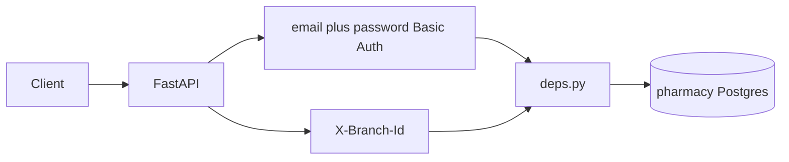

# Pharmacy Server API Blueprint

API specification for Indian multi-pharmacy retail software backed by the PostgreSQL `pharmacy` database.

**Related docs**

| File                                             | Purpose                            |
| ------------------------------------------------ | ---------------------------------- |
| [schema/SCHEMA.md](schema/SCHEMA.md)             | Database tables and business rules |
| [schema/pharmacy.sql](schema/pharmacy.sql)       | DDL                                |
| [schema/sample_data.sql](schema/sample_data.sql) | Demo tenant / robot pick data      |

This document is the reviewable API map. Routers are implemented only after this file is approved, in the phased order below.

---

## 1. Goals

- Multi-tenant accounts: one owner (`tenant_master`) manages many shops (`pharmacy_branches`).
- Staff identified by **email + password** on each request (no access tokens).
- Catalog, stock, robot shelf picking from prescriptions, then GST purchases/sales.
- Every transactional API is scoped by **tenant** (from the authenticated user) and **branch** (from header).

---

## 2. Stack

| Layer           | Choice                                                                            |
| --------------- | --------------------------------------------------------------------------------- |
| Framework       | FastAPI + Pydantic v2                                                             |
| Database        | PostgreSQL 14+ database name `pharmacy`                                           |
| ORM             | SQLAlchemy 2.0 **async** + **asyncpg**                                            |
| Auth            | HTTP Basic: email as username + password (verified against `users.password_hash`) |
| Config          | `.env` via `pydantic-settings`                                                    |
| Package manager | `uv` ([pyproject.toml](pyproject.toml))                                           |

### Suggested `.env`

```env
DATABASE_URL=postgresql+asyncpg://lokeshwarana@localhost:5432/pharmacy
APP_NAME=pharmacy-server
```

### Target project layout

```text
app/
  main.py                 # FastAPI app, CORS, include routers
  core/
    config.py             # Settings from .env
    security.py           # password hash and verify
  db.py                   # async engine, session factory
  models/                 # SQLAlchemy models (mirror schema)
  schemas/                # Pydantic request/response
  routers/
    auth.py
    branches.py
    users.py
    lookups.py
    manufacturers.py
    medicines.py
    suppliers.py
    stock.py
    robot.py
    prescriptions.py
    customers.py
    doctors.py
    purchases.py
    sales.py
    returns.py
  deps.py                 # get_db, get_current_user, get_current_branch
  services/               # stock sync, invoice sequences, robot pick
main.py                   # entry: uvicorn app.main:app (or move fully under app/)
```

---

## 3. Cross-cutting conventions

### Base URL

All business APIs: **`/api/v1`**

Public (no password): `POST /api/v1/auth/register`, `GET /health`

### Auth (username + password, no tokens)

There is **no** access token, refresh token, or `Authorization: Bearer`.

Every protected route requires HTTP Basic Auth. Use **email** as the username (the `users` table has no separate username column):

```http
Authorization: Basic base64(email:password)
```

Example: email `owner@caremed.example`, password `Secret123!`

The server:

1. Optionally accepts `X-Tenant-Id` when the same email could exist under more than one tenant (unique key is `(tenant_id, email)`).
2. Loads `users` where `email` matches, `is_active` and `status=ACTIVE`.
3. Verifies `password`
4. Attaches `user_id`, `tenant_id`, and `role` to the request.

Wrong credentials → `401`. Locked/inactive user → `403`.

`sessions` is unused in V1 (no refresh tokens).

### Branch header

Required on **branch-scoped** routes (stock, robot, purchases, sales, prescriptions for a shop):

```http
X-Branch-Id: 1
```

Server checks `user_branch_access` for `(user_id, branch_id)` and that `pharmacy_branches.tenant_id` matches the user’s tenant. Reject with `403` if missing or foreign.

Tenant-scoped catalog routes (medicines, manufacturers, suppliers) do **not** require `X-Branch-Id` unless filtering by branch-local supplier.

### Response shape

**Success (single):** resource JSON  
**Success (list):**

```json
{
  "items": [],
  "total": 0,
  "limit": 50,
  "offset": 0
}
```

**Error:**

```json
{
  "detail": "Human-readable message",
  "code": "BRANCH_FORBIDDEN"
}
```

### Soft delete

Prefer `is_active = false` over hard delete for masters and headers.

### Money and quantities

- Money: decimal strings in JSON (e.g. `"12.50"`) mapped to `Numeric`
- Stock/shelf qty: **loose units** (same as `branch_stock.current_qty`)

---

## 4. Request context flow



---

## 5. Full API map

### 5.1 Health

| Method | Path      | Auth | Purpose                      |
| ------ | --------- | ---- | ---------------------------- |
| GET    | `/health` | No   | Liveness; optionally ping DB |

---

### 5.2 Auth and tenancy

| Method | Path                               | Auth                   | Purpose                                    | Tables                                                                                                    |
| ------ | ---------------------------------- | ---------------------- | ------------------------------------------ | --------------------------------------------------------------------------------------------------------- |
| POST   | `/api/v1/auth/register`            | No                     | Create tenant + owner user + first branch  | `tenant_master`, `users`, `pharmacy_branches`, `tenant_settings`, `branch_settings`, `user_branch_access` |
| GET    | `/api/v1/me`                       | Yes (email + password) | Current user, role, tenant, branches       | `users`, `roles`, `user_branch_access`                                                                    |
| GET    | `/api/v1/branches`                 | Yes                    | List shops for tenant                      | `pharmacy_branches`                                                                                       |
| POST   | `/api/v1/branches`                 | Yes (OWNER)            | Add shop                                   | `pharmacy_branches`, `branch_settings`                                                                    |
| GET    | `/api/v1/branches/{branch_id}`     | Yes                    | Shop detail (GSTIN, DL, FSSAI, pharmacist) | `pharmacy_branches`                                                                                       |
| PATCH  | `/api/v1/branches/{branch_id}`     | Yes (OWNER)            | Update licences / address                  | `pharmacy_branches`                                                                                       |
| GET    | `/api/v1/users`                    | Yes (OWNER)            | List staff                                 | `users`                                                                                                   |
| POST   | `/api/v1/users`                    | Yes (OWNER)            | Create staff                               | `users`                                                                                                   |
| PUT    | `/api/v1/users/{user_id}/branches` | Yes (OWNER)            | Set `user_branch_access`                   | `user_branch_access`                                                                                      |

No `/auth/login`, `/auth/refresh`, or `/auth/logout`. After register, the client calls other APIs with the same email and password via Basic Auth.

Optional header on all protected routes: `X-Tenant-Id` when email is not unique across tenants.

#### `POST /auth/register` — body (detail)

```json
{
  "owner_name": "Ravi Kumar",
  "company_name": "CareMed Pharmacies Pvt Ltd",
  "pan_number": "AABCU9603R",
  "email": "owner@caremed.example",
  "phone": "9876543210",
  "password": "Secret123!",
  "branch": {
    "branch_name": "CareMed - T Nagar",
    "gstin_number": "33AABCU9603R1ZM",
    "state_code": "33",
    "address": "12 Usman Road",
    "city": "Chennai",
    "pincode": "600017",
    "pharmacist_name": "S. Priya",
    "pharmacist_reg_no": "TN/PH/12345"
  }
}
```

**Response:** `user`, `tenant`, `branches[]` (no tokens). Client then sends email + password on every later request.

---

### 5.3 Lookups (seeded, read-only)

| Method | Path                            | Auth | Table           |
| ------ | ------------------------------- | ---- | --------------- |
| GET    | `/api/v1/lookups/states`        | Yes  | `gst_states`    |
| GET    | `/api/v1/lookups/tax-rates`     | Yes  | `tax_rates`     |
| GET    | `/api/v1/lookups/hsn`           | Yes  | `hsn_master`    |
| GET    | `/api/v1/lookups/payment-modes` | Yes  | `payment_modes` |
| GET    | `/api/v1/lookups/roles`         | Yes  | `roles`         |

---

### 5.4 Catalog (tenant-scoped)

#### Manufacturers

| Method | Path                         | Purpose         |
| ------ | ---------------------------- | --------------- |
| GET    | `/api/v1/manufacturers`      | List / search   |
| POST   | `/api/v1/manufacturers`      | Create          |
| PATCH  | `/api/v1/manufacturers/{id}` | Update          |
| DELETE | `/api/v1/manufacturers/{id}` | Soft deactivate |

#### Medicines — `medicine_master`

| Method | Path                              | Purpose                                                              |
| ------ | --------------------------------- | -------------------------------------------------------------------- |
| GET    | `/api/v1/medicines`               | Search: `q`, `generic_name`, `barcode`, `drug_schedule`, `is_active` |
| POST   | `/api/v1/medicines`               | Create                                                               |
| GET    | `/api/v1/medicines/{medicine_id}` | Detail                                                               |
| PATCH  | `/api/v1/medicines/{medicine_id}` | Update                                                               |
| DELETE | `/api/v1/medicines/{medicine_id}` | Soft deactivate                                                      |

**Create body (fields):**

`medicine_name`, `generic_name`, `manufacturer_id`, `hsn_code`, `gst_rate`, `drug_schedule`, `pack_type`, `units_per_pack`, `strength`, `form`, `barcode`, `category`, `rx_required`

**Rule:** if `drug_schedule` in `H`, `H1`, `X` then `rx_required` must be `true`.

#### Suppliers — `supplier_master`

| Method    | Path                     | Purpose                            |
| --------- | ------------------------ | ---------------------------------- |
| GET       | `/api/v1/suppliers`      | List; optional `branch_id` filter  |
| POST      | `/api/v1/suppliers`      | Create (`branch_id` null = shared) |
| GET/PATCH | `/api/v1/suppliers/{id}` | Detail / update                    |

---

### 5.5 Inventory

Requires `X-Branch-Id`.

| Method | Path                        | Purpose                                                                   | Tables               |
| ------ | --------------------------- | ------------------------------------------------------------------------- | -------------------- |
| GET    | `/api/v1/stock`             | Batch balances; filters: `medicine_id`, `expiring_before`, `batch_number` | `branch_stock`       |
| GET    | `/api/v1/stock/{stock_id}`  | One batch line                                                            | `branch_stock`       |
| GET    | `/api/v1/stock/ledger`      | Movement history; filters: `medicine_id`, `txn_type`, date range          | `stock_ledger`       |
| POST   | `/api/v1/stock/adjustments` | Phase 5+                                                                  | `stock_adjustment_*` |
| POST   | `/api/v1/stock/transfers`   | Phase 5+                                                                  | `stock_transfer_*`   |

---

### 5.6 Robot warehouse (branch-scoped)

Requires `X-Branch-Id`.

| Method | Path                                    | Purpose                                                             | Tables          |
| ------ | --------------------------------------- | ------------------------------------------------------------------- | --------------- |
| GET    | `/api/v1/robot/racks`                   | List racks                                                          | `robot_racks`   |
| POST   | `/api/v1/robot/racks`                   | Create rack (`rack_number`, `row_count`, `column_count`)            | `robot_racks`   |
| POST   | `/api/v1/robot/racks/{rack_id}/shelves` | Materialize all cells `1..row_count` × `1..column_count` if missing | `robot_shelves` |
| GET    | `/api/v1/robot/shelves`                 | List; filters: `rack_id`, `empty=true`, `medicine_id`               | `robot_shelves` |
| GET    | `/api/v1/robot/shelves/{shelf_id}`      | Detail                                                              | `robot_shelves` |
| PATCH  | `/api/v1/robot/shelves/{shelf_id}`      | Place / clear SKU                                                   | `robot_shelves` |

#### `PATCH /robot/shelves/{shelf_id}` — place stock

```json
{
  "medicine_id": 1,
  "stock_id": 10,
  "capacity_qty": 200,
  "current_qty": 125,
  "shelf_code": "R1-R1-C1"
}
```

**Rules:**

- Occupied shelf: only one `medicine_id` (never mix SKUs).
- If `stock_id` set, `medicine_id` required and must match that batch’s medicine.
- `current_qty <= capacity_qty`.
- Clear shelf: set `medicine_id`/`stock_id` null and `current_qty` 0 (OWNER/INVENTORY).

---

### 5.7 Prescriptions = robot orders (branch-scoped)

Requires `X-Branch-Id`.

| Method | Path                                        | Purpose                                  |
| ------ | ------------------------------------------- | ---------------------------------------- |
| GET    | `/api/v1/prescriptions`                     | List; filter `robot_status`              |
| POST   | `/api/v1/prescriptions`                     | Create Rx + items; `robot_status=QUEUED` |
| GET    | `/api/v1/prescriptions/{id}`                | Detail + items + pick history            |
| POST   | `/api/v1/prescriptions/{id}/robot/start`    | `PICKING`, set `robot_started_at`        |
| POST   | `/api/v1/prescriptions/{id}/robot/pick`     | Pick units from shelf(s)                 |
| POST   | `/api/v1/prescriptions/{id}/robot/complete` | `COMPLETED`, set duration                |
| POST   | `/api/v1/prescriptions/{id}/robot/fail`     | `FAILED`, optional note                  |

#### `POST /prescriptions` — body

```json
{
  "customer_id": 1,
  "doctor_id": 1,
  "prescription_date": "2026-08-24",
  "notes": "Fever",
  "items": [
    {
      "medicine_id": 1,
      "dose": "1 tablet SOS",
      "qty_authorised": 15,
      "duration": "3 days"
    }
  ]
}
```

Creates `prescriptions` + `prescription_items`. Ensures customer/doctor belong to same tenant. For H/H1/X medicines, doctor is required (already on header).

#### Robot status machine

```text
QUEUED → PICKING → COMPLETED
                 ↘ FAILED
```

Invalid transitions → `409 Conflict`.

#### `POST .../robot/start`

Sets `robot_status=PICKING`, `robot_started_at=now()` if currently `QUEUED`.

#### `POST .../robot/pick` — body

```json
{
  "picks": [
    {
      "prescription_item_id": 1,
      "shelf_id": 5,
      "qty_units": 15
    }
  ]
}
```

**In one DB transaction per pick line (or whole request):**

1. Validate shelf belongs to current branch; shelf `medicine_id` matches prescription item medicine; `current_qty >= qty_units`.
2. Insert `robot_pick_items`.
3. Decrement `robot_shelves.current_qty`.
4. Decrement `branch_stock` for shelf’s `stock_id` (or resolve batch); update pack/loose in service layer.
5. Insert `stock_ledger` with `txn_type=ROBOT_PICK`, `txn_id=prescription_id`, `qty_delta=-qty_units`.

Must be `robot_status=PICKING`.

#### `POST .../robot/complete`

```json
{ "notes": null }
```

Requires `PICKING`. Sets `robot_completed_at=now()`,  
`robot_duration_seconds = floor(epoch(completed - started))`,  
`robot_status=COMPLETED`.

#### `POST .../robot/fail`

```json
{ "reason": "Shelf empty mid-pick" }
```

Sets `FAILED`, `robot_completed_at`, duration if started.

---

### 5.8 Customers and doctors (tenant-scoped; needed before sales / Rx)

| Method    | Path                     | Table       |
| --------- | ------------------------ | ----------- |
| GET/POST  | `/api/v1/customers`      | `customers` |
| GET/PATCH | `/api/v1/customers/{id}` | `customers` |
| GET/POST  | `/api/v1/doctors`        | `doctors`   |
| GET/PATCH | `/api/v1/doctors/{id}`   | `doctors`   |

Implement with Phase 3–4 (Rx needs them; sales needs customers).

---

### 5.9 Purchases (branch-scoped) — Phase 5

| Method   | Path                              | Purpose                                                 |
| -------- | --------------------------------- | ------------------------------------------------------- |
| GET/POST | `/api/v1/purchases`               | List / create header+items                              |
| GET      | `/api/v1/purchases/{id}`          | Detail                                                  |
| POST     | `/api/v1/purchases/{id}/post`     | Confirm: upsert `branch_stock`, `stock_ledger` PURCHASE |
| POST     | `/api/v1/purchases/{id}/payments` | `purchase_payments`                                     |

**Create body (compact):** supplier_id, invoice_number, invoice_date, received_date, GST split (`cgst_amt`/`sgst_amt`/`igst_amt`), round_off, grand_total, items[] with batch, expiry, qty, free_qty, qty_units, mrp, ptr, discount, gst%.

**GST rule:** IGST alone **or** CGST+SGST, never mixed.

---

### 5.10 Sales / POS (branch-scoped) — Phase 5

| Method   | Path                          | Purpose                       |
| -------- | ----------------------------- | ----------------------------- |
| GET/POST | `/api/v1/sales`               | List / create tax invoice     |
| GET      | `/api/v1/sales/{id}`          | Detail                        |
| POST     | `/api/v1/sales/{id}/void`     | `is_void=true`; reverse stock |
| POST     | `/api/v1/sales/{id}/payments` | `sales_payments`              |
| GET      | `/api/v1/sales/h1-register`   | `schedule_h1_register` / view |

**On create/post:**

1. Allocate `invoice_number` via `document_sequences` (`SALE_INVOICE`, financial year).
2. Decrement `branch_stock`; `stock_ledger` SALE.
3. If medicine `drug_schedule=H1`, insert `schedule_h1_register` (patient, doctor, batch, bill).
4. H/H1/X lines require `prescription_id` on the sale item.

---

### 5.11 Returns — Phase 5+

| Method | Path                       | Tables              |
| ------ | -------------------------- | ------------------- |
| POST   | `/api/v1/purchase-returns` | `purchase_return_*` |
| POST   | `/api/v1/sales-returns`    | `sales_return_*`    |

---

## 6. Role matrix (V1)

| Role       | Typical access                                 |
| ---------- | ---------------------------------------------- |
| OWNER      | All tenant + all branches                      |
| PHARMACIST | Sales, Rx, H1, robot complete; limited catalog |
| CASHIER    | Sales, payments, customers                     |
| INVENTORY  | Purchases, stock, robot shelves, transfers     |

Exact route guards can start as: OWNER unrestricted; others allowed on their domain routers. Refine with a permission table later if needed.

---

## 7. Implementation phases

Do **not** build all routers at once. Order:

| Phase | Deliverable                       | Endpoints                                                           |
| ----- | --------------------------------- | ------------------------------------------------------------------- |
| **0** | Skeleton                          | Settings, DB session, `GET /health`, empty FastAPI app under `app/` |
| **1** | Auth + shops                      | Register, Basic Auth on `/me`, branches, users, branch access       |
| **2** | Catalog                           | Lookups, manufacturers, medicines, suppliers                        |
| **3** | Customers/doctors + stock read    | CRM + `GET /stock`, ledger read                                     |
| **4** | Robot + Rx pick                   | Racks, shelves, prescriptions, start/pick/complete/fail             |
| **5** | Purchases then sales              | Invoices, payments, H1 register, void                               |
| **6** | Returns / adjustments / transfers | As needed                                                           |

After each phase: smoke-test against local DB (sample data already loaded for robot demos).

---

## 8. Sample data alignment

[schema/sample_data.sql](schema/sample_data.sql) provides:

- Tenant `owner@caremed.example`, branch **CareMed - T Nagar**
- Medicines Dolo 650 / Augmentin 625
- Rack 1 `2×2` shelves
- One completed prescription with picks

Use for Phase 4 integration tests (Basic Auth email/password → `X-Branch-Id` → list shelves → create Rx → pick).

**Note:** sample password hash is a placeholder; Phase 1 register should store a real bcrypt/argon2 hash. Re-seed or update the sample user password when auth is implemented.

---

## 9. Out of scope (first API cut)

- E-invoicing / IRN / e-way bill
- Payroll / accounting ledgers
- Bulk import of all [indian_medicine.csv](indian_medicine.csv) (optional later script)
- Mobile robot firmware protocol (HTTP APIs only; robot is a client of `/robot/*` and `/prescriptions/*/robot/*`)

---

## 10. Acceptance checklist for this blueprint

- [ ] Reviewers agree on `/api/v1` paths and `X-Branch-Id` rule
- [ ] Robot pick transaction steps (shelf + stock + ledger) accepted
- [ ] Phase order accepted before coding routers
- [ ] Then implement Phase 0–1 against the live `pharmacy` database

---

## 11. Next step after approval of this file

1. Add dependencies: `sqlalchemy[asyncio]`, `asyncpg`, `passlib[bcrypt]`, `pydantic-settings`.
2. Create `app/` package with config + DB + health.
3. Implement Phase 1 against `users`, `tenant_master`, `pharmacy_branches` using HTTP Basic (email + password). Do not use JWT or `sessions`.
